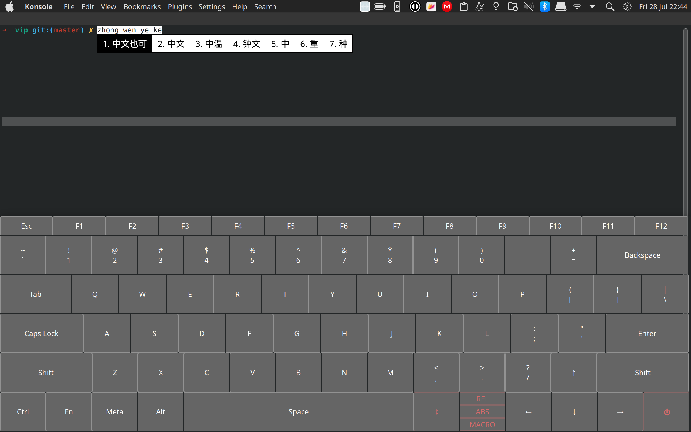

# Virtual Input Panel

Author: Shukai Ni



## Build and Install

```shell
# PKGBUILD works manually
makepkg -si
```

```shell
yay -S extra-cmake-modules
kf5-config --version
```

```shell
cmake -B build && cmake --build build
cmake --install build
sudo chown root:root build/vip
sudo chmod 4755 build/vip
```

## Why Virtual Input Panel is more than on-screen keyboard(OSK)

1. Enhanced touchscreen compatibility in Wayland-based KDE Plasma environment.
2. Flexible layout, theme, and input device configuration (e.g., Keyboard, Mouse) options.
3. Kernel-level handling of input events.
4. Comprehensive support for modifier keys.
5. Extensive integration of input methods.
6. Full system hotkeys compatibility.
7. Seamless recognition of simultaneous key presses.
8. Panel repositioning enabled through dragging the reposition key.
9. Dynamic pointer movement simulation (relative or absolute).
10. Macro execution for a sequence of actions with a single key press(keys, mouses, sleeps, nested loops).

## Notes

1. Mouse(instead of touch) events are not enabled by default and discouraged, because a simulated mouse event would create a event loop without careful layout design. Enable it by removing `add_definitions(-DMOUSE_EVENT)`.
2. Right ctrl and right alt is by default not included to save layout space.

## Keyboard JSON Representation Documentation

The following is a detailed documentation for the JSON representation of a keyboard layout. This representation is designed to capture the structure and attributes of a keyboard, including keys with different sizes and weights.

- totalWidth (integer): The total width of the keyboard in pixels.

- totalHeight (integer): The total height of the keyboard in pixels.

- spacing (double): The spacing between keys. It represents the gap between adjacent keys in pixels.

- style (string): The CSS style for all keys. It is a string that can be used to specify the default style of all keys in the keyboard. For example, "background-color: #ffffff; color: #000000".

- rows (array): An array of objects representing individual rows on the keyboard.

  - rowSpan (double): The row span weight compared to other rows. It determines the height of the row relative to the total keyboard height, with default weight being 1 if not specified.

  - keys (array): An array of objects representing individual keys within the row.

    - type (string): The type of the key. This can include values like "key," "mouse_button," "modifier," "special," etc. This allows for future extension to include different types of keys with specific behaviors.

    - code (integer): The key code or identifier for the key. This could be an integer (e.g., 1, 2, 16, etc.) from `/usr/include/linux/input-event-codes.h`.

    - label (string, optional): The label displayed on the key. It provides a human-readable description for the key. For example, "Esc" for the escape key.

    - columnSpan (double, optional): The column span weight compared to other keys in the row. It determines the width of the key relative to other keys in the same row, with default weight being 1 if not specified. If a key needs to occupy more than one column width, specify a higher weight for that key.

    - style (string, optional): The CSS style for the key. It is a string that can be used to specify the style of the key. For example, "background-color: #ffffff; color: #000000".

- customKeys (array, optional): An array of objects representing custom keys. Custom keys are keys that are not part of the keyboard layout, but are displayed on the keyboard. For example, a custom key can be used to display a logo or a special key that is not part of the keyboard layout. Custom keys are displayed on top of the keyboard layout. Use `placeholder` keys to reserve space for custom keys.

  - type (string): The type of the key. This can include values like "key," "mouse_button," "modifier," "special," etc. This allows for future extension to include different types of keys with specific behaviors.

  - code (integer): The key code or identifier for the key. This could be an integer (e.g., 1, 2, 16, etc.) from `/usr/include/linux/input-event-codes.h`.

  - label (string, optional): The label displayed on the key. It provides a human-readable description for the key. For example, "Esc" for the escape key.

  - x (double): Ratio of the x coordinate of the key relative to the total width.

  - y (double): Ratio of the y coordinate of the key relative to the total height.

  - w (double): Ratio of the width of the key relative to the total width.

  - h (double): Ratio of the height of the key relative to the total height.

  - style (string, optional): The CSS style for the key. It is a string that can be used to specify the style of the key. For example, "background-color: #ffffff; color: #000000".

- macros (array, optional): An array of objects representing macros. Macros are predefined sequences of actions that can be executed by pressing a single key. For example, a macro can be used to execute a sequence of key presses to open a specific application. Macros are executed in the order they are defined in the array.

  - length = 1: sleep array[0] microseconds

  - length = 2: repeat previous array[0] actions for array[1] times

  - length = 3: calls key actions with type = array[0], code = array[1], value = array[2]

This JSON representation aims to provide a comprehensive and flexible way to describe keyboard layouts while supporting easy modifications and extensions in the future. It allows for capturing various keyboard configurations, key types, and weights to accommodate different key sizes and layouts in modern keyboard designs.

## Key types

### Regular key

### Mouse key

### Special key

### Macro key

## TODO

- [x] Exit Key: Implementation of an exit key to close the application
- [x] Multi-Touch Event: Implementation of multi-touch support to handle multiple touch inputs concurrently
- [x] Click/Touch Event Support: Provision of support for both click and touch events as input methods.
- [x] Custom Theme: Incorporation of a customizable theme feature allowing users to personalize the appearance of the application.
- [x] Special Key for Panel Reposition: Introduction of a dedicated key to facilitate repositioning of application panels.
- [x] Placeholder for Custom Keys: Provision of a placeholder to reserve space for custom keys, which users can define according to their requirements.
- [x] Custom keys: Keys that are not part of the keyboard layout, but are displayed on the keyboard at predefined locations.
- [x] Mouse Emulation: Implementation of mouse emulation to simulate mouse actions.
  - [x] Relative update: requires `BUTTON_LEFT` to function
  - [x] Absolute update: requires struct uinput_abs_setup setup
- [x] PKGBUILD: package build script used in Arch Linux and related distributions.
- [x] Input macro: allowing users to create and execute predefined sequences of actions.
- [ ] System level config: System-level configuration at /etc/vip.d/\*.json
- [ ] Layout switch: Implementation of a layout switch feature to enable users to change the keyboard layout dynamically.
- [ ] Improve README.md: Add more details to the README.md file, especially for the JSON representation and key types.
- [ ] Haptic feedback: Addition of sound/effects for both key press and release events to enhance user experience.
- [ ] Spoofing: spoof the device's vendor id and name.
- [ ] Spacing config: Option to configure the spacing between keys and elements for better layout customization.
- [ ] Verify PKGBUILD: ensure correctness and security.
- [ ] Improve reposition smoothness: Enhancements to the repositioning feature to provide smoother and more seamless drag.
